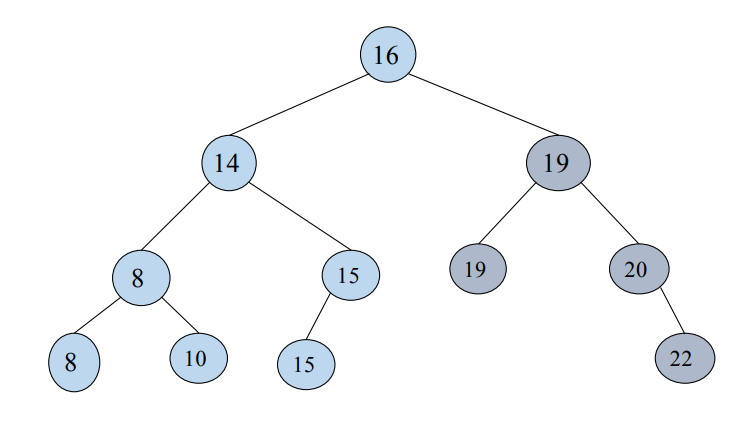
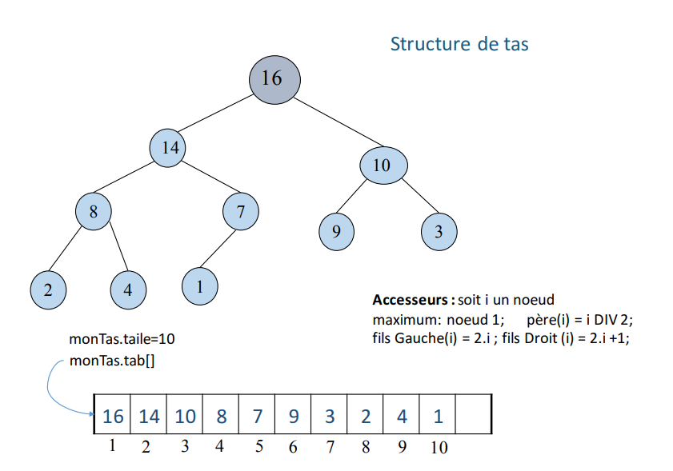
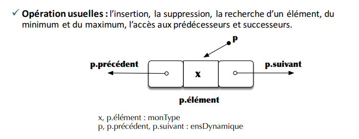

# TDA

Une **structure de données** est une manière d’organiser les sonnées en mémoire pour en assurer une gestion efficace. Une structure de données implémente concrètement un type abstrait. 

## Pile
Une **pile** est une structure de données fondée sur le principe que le dernier élément insérer sera le prochain élément à être traité. Une telle structure est aussi appelé LIFO (last-in, first out).
### Opérations : 
	creerPile : {} → Pile(T)  //La pile est vide
	estVide : Pile(T) → Booleen
	empiler : T * Pile(T)  → Pile(T) //T est l’élément à empiler. 
	depiler : Pile(T) → T * Pile(T) // T est l’élément à dépiler (seulement si estVide(T) = Faux)
### Axiomes : 
	estVide(creerPile()) = Vrai
	estVide(empiler(x,p)) = Faux
	depiler(empiler(x,p))=(x,p)

 
## File
Une	**file**, dite	aussi file d'attente	(en	anglais	queue),	est	une	structure	de données basée	sur	le	principe	du	premier	entré,	 premier	sorti	ou	PEPS,	(en	anglais	FIFO	(first	in,	first	out).	Autrement	 dit	que	les	premiers éléments ajoutés	à	la file	seront	les	premiers	à	en	être	retirés.
### Opérations : 
	creerFile : {} → File(T)  //La File est vide
	estVide : File(T) → Booleen
	enfiler : T * File(T)  → File(T) //T est l’élément à enfiler. 
	defiler : File(T) → T * File(T) // T est l’élément à défiler (seulement si estVide(T) = Faux)
### Axiomes : 
	estVide(creerFile()) = Vrai
	estVide(enfiler(x,f)) = Faux
	defiler(emfiler(x,creerFile))=(x,creerFile)
## Arbre binaire de recherche
Un **arbre binaire** est un A.B.R si pour tout noeud s, les contenus des noeuds du sous-arbre de gauche sont inférieurs au contenu de s et les contenus du sous-arbre droit sont supérieurs au contenu de s.

## Structure de tas
Une structure de tas est un arbre binaire presque complet tel que pour tout noeud n sauf la racine, la valeur affectée au père est supérieur ou égale à celles de ses fils. 

## Ensemble dynamique
On appelle **ensemble dynamique** e un ensemble fini d'éléments issus d'un ensemble discret (entiers, chaine de caractères,...) et muni d'une relation d'ordre. 

