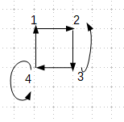
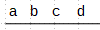
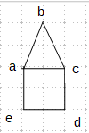
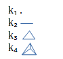
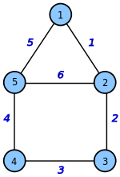
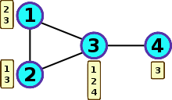

 {#section .unnumbered}

L’UE de théorie des graphes est à 6 ECTS (Système européen de transfert
et d’accumulation de crédits.\
L’évaluation se fera en contrôle continue.\
Ecrit n°1 (Début novembre) -\> 33%\
Ecrit n°2 (Fin décembre)-\> 33%\
Projet (TP) -\> 33%\

Introduction
============

Un graphe (fini) est défini sur un ensemble de sommet et par un ensemble
d’arêtes tel que $ E \subseteq V \times V $\
\
Exemple 1 :\
$ G=(V,E)$\
$ V=\{1,2,3,4\} $\
$ E=\{(1,2),(2,3),(3,4),(4,1),(1,3)\} \cup \{(3,2),(4,4)\}$\
$ (1,2) \neq (2,1)$\
\
 Il s’agit d’un graphe orienté.\
\
Exemple 2 :\
$ H=(w,F) $\
$ w=\{a,b,c,d\} $\
$ F=\{\{a,b\},\{b,c\},\{c,d\}\} $\
\

Historique
==========

1726 : Leonard Eules\
Problème des 7 ponts Konigsberg\
Si on part d’un pont particulier sur le bord de la rivière est ce qu’on
peut revenir à ce même point en passant exactement une fois sur chacun
des points.\

1850 : Hamilton\
Peut on trouver un cheminement sur un graphe en passant exactement une
fois sur chaque sommet.\

Application
===========

- Trouver un plus court chemin d’un point A à un point B.\

- Minimiser le nombre de fréquence nécessaire pour un réseau de
téléphonie mobile.\

Point de vue
============

- Algorithmique\

- Algébrique\

- Probabiliste\

- Combinatoire\

Définition usuelle
==================

Boucle
------

Une arête dont le point de départ est le point d’arrivée.

Voisinage d’un somment
----------------------

L’ensemble des sommets w tel que $ v.w \in E(G)$\
$ N_G(v)=\{w \mid \{v,w\} \in E(G) \} $\
Voisinage fermé noté : $ V_{G}[v]=N_{G}(v) \cup \{v\} $\
\
$ N(a)=\{b,c,e\} $\
$ N[a]=\{b,c,e,a\} $\
Voisinage entrant : $ N^{-}(a)=\{y \in V \mid yx \in E\} $\
Voisinage sortant : $ N^{+}(a)=\{y \in V \mid xy \in E\} $\

Degrés d’un sommet
------------------

Le degré de v noté $d_{G}(v)$, est le nombre de voisin de v.\
$ d_{G}(v)=\mid v(v) \mid $\

\
$ d_{G}(a)=3 $

Degrés d’un graphe
------------------

Le degrés minimum d’un graphe noté $ \delta(G) $, est le nombre minimum
de voisins pour un sommet dans le graphe.\
$ \delta(G) = min \mid d(v) \mid v \in V(G)\} $\

Le degrés maximum d’un graphe noté $ \Delta(G) $, est le nombre maximum
de voisins pour un sommet dans le graphe.\
$ \Delta(G) = max \mid d(v) \mid v \in V(G)\} $
\
$ \delta(G)=2 $\
$ \Delta(G)=3 $\

Chemin
------

Un chemin P est une séquence linéaire du sommets $(v_1,v_2,…,v_{k })$
tous les $ v_i $ sont distincts. $ {v_i,v_{i+1}\} \in E(G) $ pour tous
les $ i \in \{1,…,k-1\} $.

Cycle
-----

Un cycle est une séquence circulaire $ (v_1,v_2,…,v_k,v_1) $\
$ v_i,v_i+1(\%k) \in E(G) $

Marche
------

Une marche (fermé) est une séquence d’arêtes qui sont consécutives sans
contrainte de répétions.

Sous-graphe
-----------

Un sous-graphe est un graphe partiel.\
Soit $ G=(V,E) $ est un graphe, $ H=(W,F) $ est un sous-graphe de $ G $
si $ W  \subseteq V \textsf{et} F\subseteq E $\

Soit $ G=(V,E) $ est un graphe, $ H=(W,F) $ est un sous-graphe induit de
$ G $ si $ W\subseteq F $ et $ F=E \cap (w \times w) $\
$ H $ est souvent induit si on peut obtenir $ H $ à partir de $ G $ en
supprimant des sommets\

Mineur de graphe
----------------

Soit $ G=(V,E) $ est un graphe, $ H=(W,F) $ si $H$ peut être obtenue à
partir de $G$ alors :\
- Supprimer des sommets isolés\
- Supprimer des arêtes\
- Contracter d’arêtes\

Complémentaire de graphe
------------------------

Soit $G=(V,E)$ un graphe non orienté. Le complémentaire de $G$ noté
$\overline{G}$ avec $\overline{G}=(V,\overline{G})$.\
$\overline{E}=\begin{pmatrix} V \\ 2 \end{pmatrix} \textbackslash 2$\
$\overline{G}=(V,\overline{G})$ est l’ensemble des couples
$v_i, v_j \forall v_i, v_j  \in V $ et $v_i \neq v_j$\

Isomorphisme de graphe
----------------------

Deux graphes qui sont « égaux ».\
$G=(V,E)$ et $H=(W,E)$ sont isomorphe si et seulement si il existe une
fonction bijective $v \rightarrow w$ tel que u,v $\in E(G)$ si et
seulement si $\varphi (u), \varphi (v) \in E(H)$.\
G isomorphe à H noté G \~H.

Fonction de graphes remarquable
===============================

Stable ou ensemble indépendant
------------------------------

Ensemble de sommet qui ne contient qui ne contient pas d’arêtes.\
$S=(V,E)$ est un ensemble de sommet où $E= \emptyset$

Clique complémentaire des stables
---------------------------------

$K=(V,E)$ $E=\begin{pmatrix} V \\ 2 \end{pmatrix}$ toutes les arêtes
sont présents dans le graphe une clique sur n sommets notée $k_n$.\
\

Forêts
------

Un graphe sans cycle

Arbre
-----

Un graphe sans cycle et connexe

Graphe biparti
--------------

Un graphe $G=(v,E)$ pour lequel on peut partitionner.\
$V=A \cup B (A \cap B=\emptyset)$\
tel que G[A] (le graphe induit par A) et G[B] forment des stables.

Graphe connexe
--------------

Un graphe $G’=(V,E)$ est connexe si et seulement si entre chaque paire
de sommets $a,b$ il existe un chemin dans $G$ qui relie les sommets $a$
et $b$.

Composante connexe
------------------

Une composante connexe de graphe $G=(v,E)$ est un sous ensemble maximal
S de sommets de G tel que G[S] est connexe.\
Remarque : L’ensemble des composantes connexes d’un graphe forment une
partition des sommets. Cette partition est unique.

La représentation des graphes en machine
========================================

La matrice adjacence
--------------------

Soit M avec n lignes et n colonnes.\
Chaque lignes et chaque colonnes représentent un sommet.\
$ M_{i,j}=\left\{\begin{array}{rl}

    1 & \mbox{si } (v_i,v_j)\in E \\

        0 & \mbox{sinon.}

\end{array}\right. $\
Exemple :\
\
$M=\begin{pmatrix}
1 & 1 & 0 & 0 & 1 & 0\\
1 & 0 & 1 & 0 & 1 & 0\\
0 & 1 & 0 & 1 & 0 & 0\\
0 & 0 & 1 & 0 & 1 & 1\\
1 & 1 & 0 & 1 & 0 & 0\\
0 & 0 & 0 & 1 & 0 & 0
\end{pmatrix} $

Soit G un graphe avec n sommets et m arrêtes.\
- espace : $O(n^2)$\
- Tester l’adjacence de deux sommets : $O(1)$\
- Connaître les voisins : $O(n)$\
\

La matrice d’incidence
----------------------

Les lignes représentent les sommets et les colonnes représentent les
arêtes. le coefficient de la matrice d’incidence en ligne $i$ et en
colonne $j$ vaut :\
\
1 si le sommet $v_i$ est une extrémité de l’arête $x_j$\
2 si l’arête $x_j$ est une boucle sur $v_i$\
0 sinon\
Exemple :\
\
Prenons le cas du graphe ci-contre. Il possède 5 sommets et 6 arêtes, la
matrice d’incidence aura donc 5 lignes et 6 colonnes :\
le sommet 1 est l’aboutissement des arêtes 1 et 5\
le sommet 2 est l’aboutissement des arêtes 1, 2 et 6\
le sommet 3 est l’aboutissement des arêtes 2 et 3\
le sommet 4 est l’aboutissement des arêtes 3 et 4\
le sommet 5 est l’aboutissement des arêtes 4, 5 et 6\
\
$M=\begin{pmatrix}
1 & 0 & 0 & 0 & 1 & 0\\
1 & 1 & 0 & 0 & 0 & 1\\
0 & 1 & 1 & 0 & 0 & 0\\
0 & 0 & 1 & 1 & 0 & 0\\
0 & 0 & 0 & 1 & 1 & 1\\
\end{pmatrix}$\

Liste adjacente
---------------

Une première liste qui correspond au sommet.\
Pour chaque sommet on la liste des voisins.\
Exemple :\
\
Soit G un graphe avec n sommets et m arrêtes.\
- Espace : $O(n+m)$\
- Tester l’adjacence de deux sommets : $O(min \{ d(u), d(v) \})$\
- Connaître les voisins : $O( d(v) )$\

